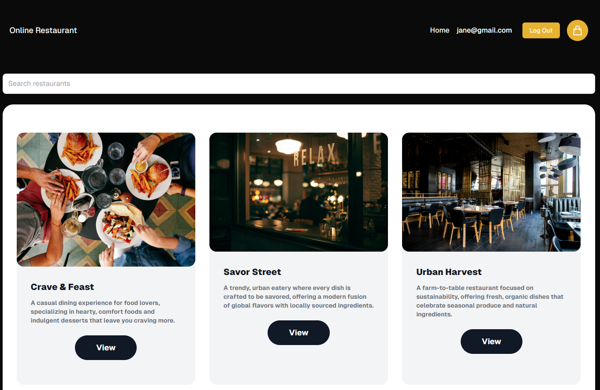
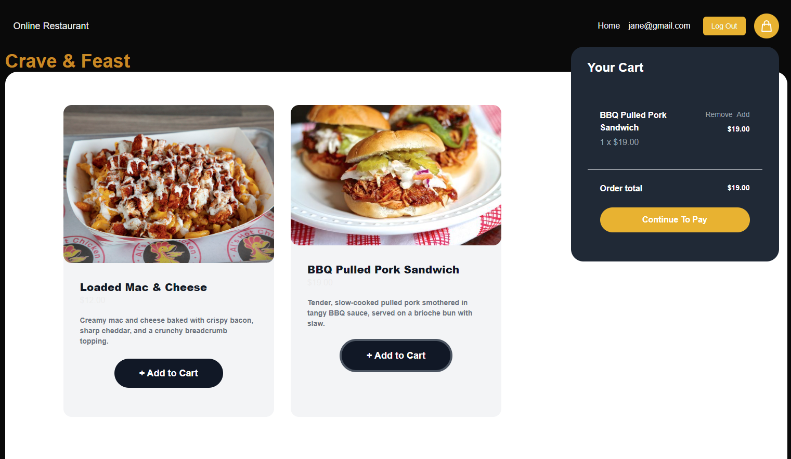

# Online Restaurant APP NextJS

### Version
0.1.0

### License
Copyright &copy; 2024 Shehan Rathnayake. All Rights Reserved. 
This project is licensed under [MIT License](License.txt).

## Introduction
This is a basic online food ordering app frontend which includes restaurants and their respective dishes developed using NextJS.

## Key Features
- React context API for globaly state management
- Cart functionality
- Authentication and role based Authorization
- Intergration with Stripe payment gateway

## Tech Stack Used
- NextJS React framework
- JWT Tokens
- Stripe Payment Gateway

## Supported Links
- [Backend GitHub Repository](https://github.com/shehanrathnayake/online-restaurants-app-backend-strapi)

## Sample Images
 

 

### Support

***If you like what I do, maybe consider buying me a coffee*** 🥺 👇

  